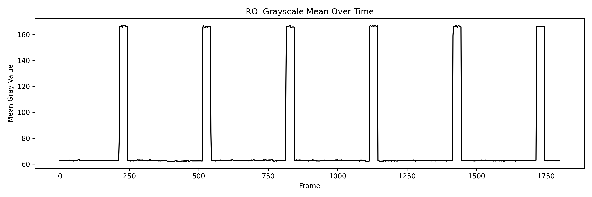

# ROI Video Analyzer v2.0

[](https://python.org)
[](https://www.riverbankcomputing.com/software/pyqt/)
[](LICENSE)

PyQt5 桌面应用 —— 视频 ROI 区域灰度分析与阈值二值化工具。

> 对视频中任意 ROI 区域进行实时灰度统计、生成均值曲线、按阈值二值化并导出 CSV / PNG。



## 功能

| 功能 | 说明 |
|------|------|
| 视频播放控制 | 多格式支持 (MP4/AVI/MOV/MKV 等)，逐帧步进、连续播放 |
| 交互式 ROI | 鼠标拖拽绘制、拖拽移动、右下角手柄缩放、Ctrl+滚轮缩放 |
| 实时灰度统计 | 均值 / 最小值 / 最大值 / 二值结果，4 宫格卡片实时显示 |
| 灰度均值曲线 | 逐帧计算 ROI 灰度均值，pyqtgraph 实时渲染曲线 |
| 阈值二值化导出 | 高于阈值 → 1，否则 → 0，输出 CSV（含自定义列名） |
| 灰度图 PNG 导出 | 基于 matplotlib 生成 ROI 灰度均值变化图，300 DPI |
| 深色主题 | Catppuccin Mocha 全组件覆盖 QSS 样式 |
| 双引擎处理 | ffmpegcv 优先（高性能 ROI crop），OpenCV 回退（兼容） |

## 安装

```bash
git clone https://github.com/zhuyuhang4/ROI_Video_Analyzer_v2.git
cd ROI_Video_Analyzer_v2
conda create -n py38 python=3.8
conda activate py38
pip install -r requirements.txt
```

### 依赖

```
opencv-python==4.10.0.84
PyQt5==5.15.11
pyqtgraph==0.13.3
ffmpegcv==0.3.15
numpy>=1.24.3
matplotlib>=3.7.1
pyinstaller==6.18.0
```

## 使用

```bash
python main.py
```

### 操作流程

1. **打开视频** — 点击「打开视频」选择文件
2. **绘制 ROI** — 鼠标拖拽绘制感兴趣区域，可拖拽移动、右下角调大小
3. **查看统计** — 右侧面板实时显示灰度均值/最小值/最大值/二值结果
4. **调整阈值** — 拖动阈值滑条（0-255），分割预览条直观显示暗区/亮区
5. **导出 CSV** — 点击「阈值处理 → 导出 CSV」，ffmpegcv 逐帧处理后保存
6. **导出 PNG** — 点击「导出 ROI 灰度图 PNG」，生成 300 DPI 均值曲线图
7. **计算曲线** — 点击「计算均值曲线」，在视频面板下方实时渲染

### 快捷键

| 操作 | 快捷键 |
|------|--------|
| 缩放视频 | `Ctrl + 滚轮` |
| 绘制 ROI | 鼠标拖拽 |
| 移动 ROI | 拖拽 ROI 内部 |
| 调整 ROI 大小 | 拖拽右下角手柄 |

## 架构

```
main.py                 # 程序入口
app.py                  # VideoPlayer 主窗口（工具栏 + 视频面板 + 侧栏编排）
video_label.py          # VideoLabel — 视频渲染 + ROI 交互 + 缩放平移
side_panel.py           # 右侧参数侧栏（统计卡片 + 阈值参数 + 导出操作）
threshold_widget.py     # 阈值组件（滑条/数字联动 + 分割预览 + 列名输入）
export_worker.py        # 后台处理线程（ffmpegcv 优先 / OpenCV 回退）
styles.py               # Catppuccin Mocha 深色主题 QSS 样式表
build.bat               # Windows 批处理
docs/                   # 架构设计文档 + Mermaid 图
```

## 打包

```bash
# onefile（单 exe）
python build_simple.py

# Windows 批处理
build.bat
```

输出在 `dist/` 目录下。

## 技术要点

- **双引擎降级**：ExportWorker 优先使用 ffmpegcv 的 `crop_xywh` 参数做高效 ROI 裁剪；失败时自动回退 OpenCV
- **ROI 偶数对齐**：ffmpegcv 要求偶数宽高，自动向下/向上调整
- **信号防抖**：阈值滑条与数字输入框通过 `blockSignals` 双向绑定，避免循环触发
- **停止控制**：后台线程通过旗帜变量 + `wait()` 安全停止
- **编码**：CSV 导出使用 `utf-8-sig`，Excel 直接打开无乱码

## License

MIT
