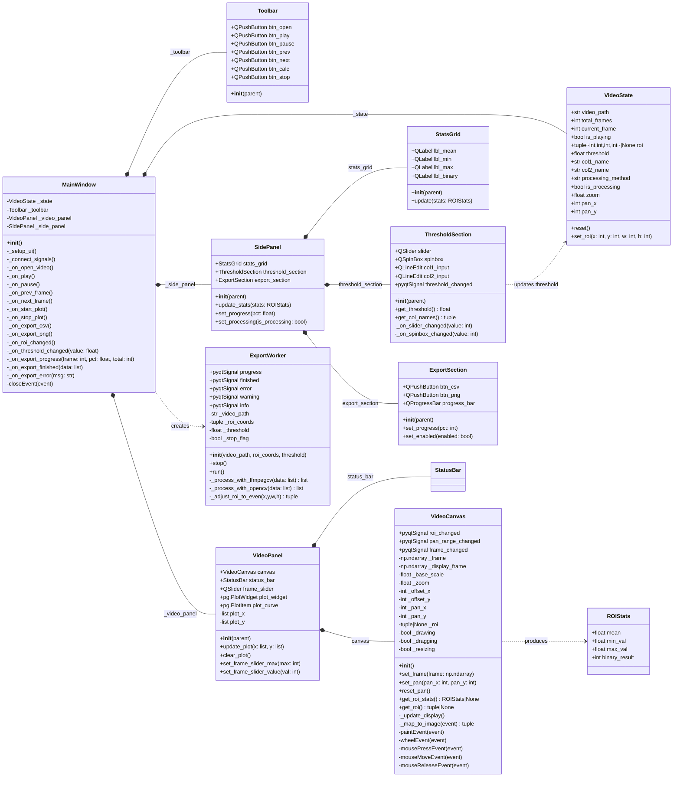
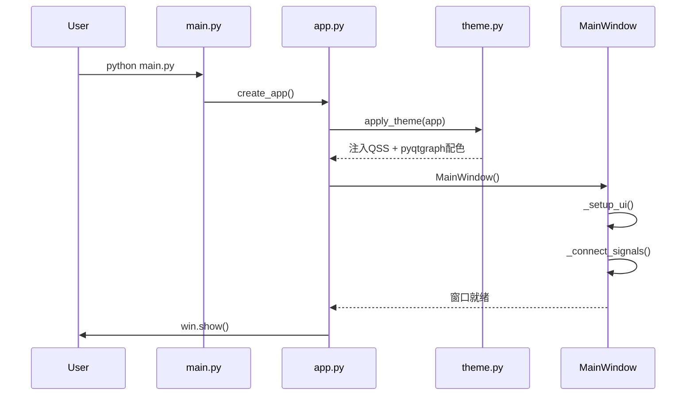
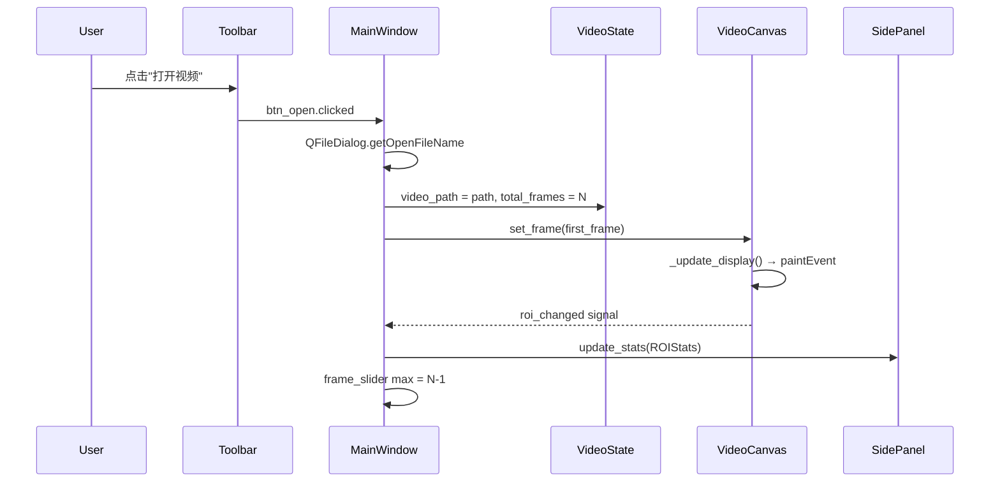
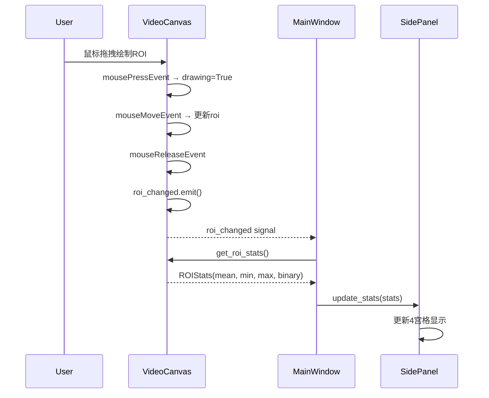
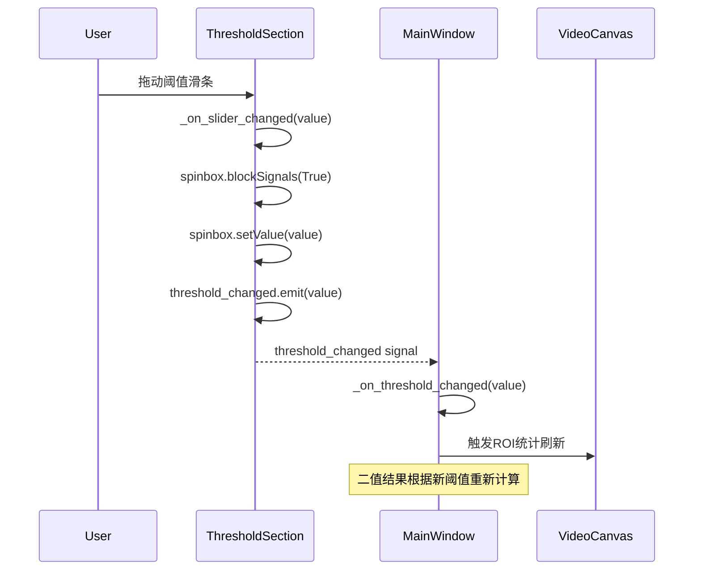
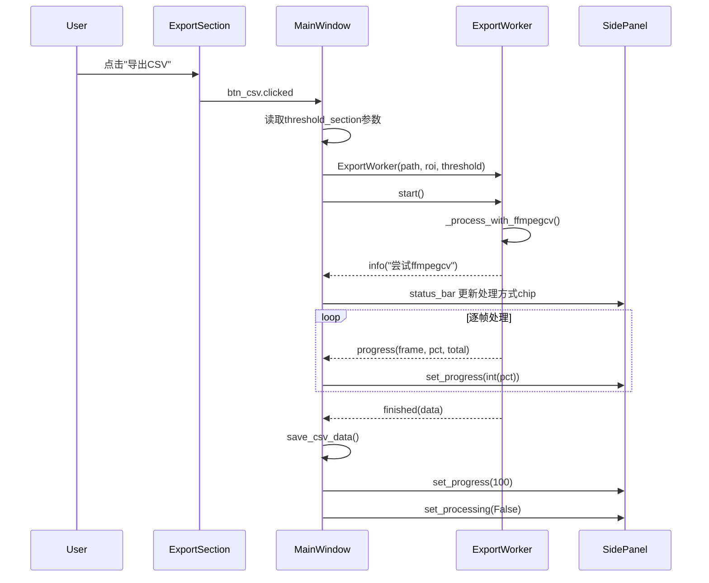
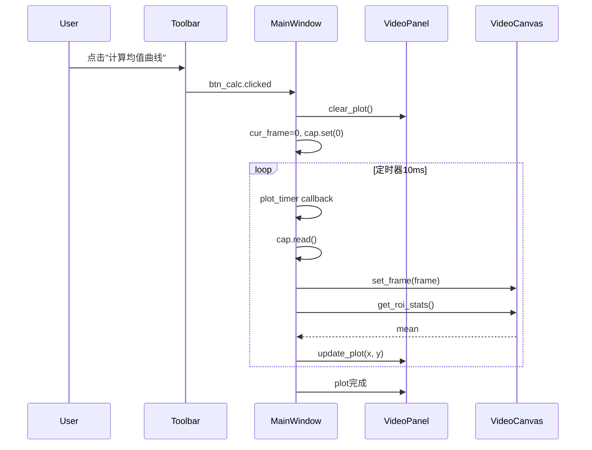
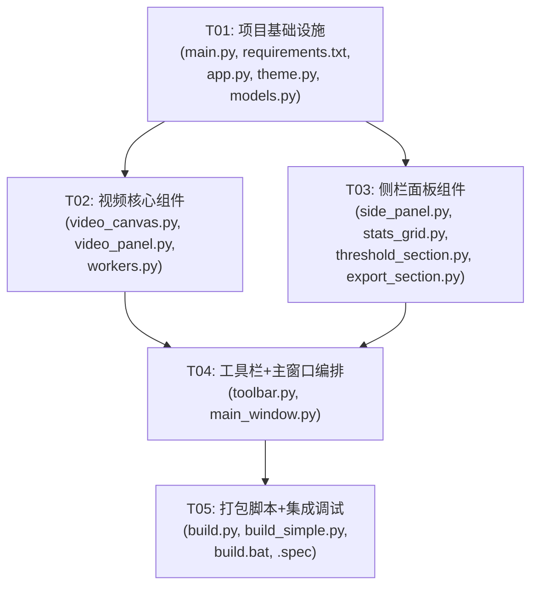

# ROI 视频分析工具 v2.0 — 系统架构设计


## Part A: 系统设计

### 1. 实现方案

#### 1.1 核心技术挑战

| 挑战 | 分析 | 方案 |
|------|------|------|
| 深色主题全局一致性 | Catppuccin Mocha 色板需覆盖所有 QWidget（QSlider、QPushButton、QLabel、pyqtgraph 等） | 统一样式模块 `theme.py`，通过 QSS 全局注入 + pyqtgraph 配置 |
| 阈值滑条+数字联动 | 滑条（0-255 int）与 QSpinBox/QLineEdit 需双向绑定且互不触发循环信号 | 用 `blockSignals(True)` 保护写端，统一走 `on_threshold_changed` 槽 |
| ROI 实时统计 4 宫格 | 每帧变化时更新灰度均值/最小值/最大值/二值结果 | 在 `VideoCanvas.mouseReleaseEvent` 和帧切换时触发 `roi_stats_changed` 信号 |
| 进度条真实反馈 | 原 `ExportWorker.progress` 信号返回 `(frame_num, progress_pct, total)` 但只更新了文字 | 侧栏增加 QProgressBar，`progress` 信号直连 `setValue(int(progress_pct))` |
| 平移滑条紧凑化 | 原版独立标签+滑条占空间大 | 去标签，滑条内嵌视频面板边缘，利用 tooltip 提示 |
| 图表嵌入视频面板 | 原 `PlotWidget` 独立占底部大块 | 视频面板用 QVBoxLayout 分为上方视频画布 + 下方图表，非独立窗口 |

#### 1.2 框架与库选择

| 库 | 版本 | 用途 | 理由 |
|----|------|------|------|
| PyQt5 | ≥5.15 | UI 框架 | 与原版一致，避免 PySide6 迁移风险 |
| pyqtgraph | ≥0.12 | 实时曲线绘制 | 原版一致，高性能数值绘图 |
| OpenCV | ≥4.5 | 视频解码/图像处理 | 原版一致，回退方案 |
| ffmpegcv | ≥1.5 | 加速视频解码 | 原版一致，ROI crop 高效读取 |
| matplotlib | ≥3.0 | PNG 导出 | 原版一致 |
| numpy | ≥1.21 | 数值计算 | 原版一致 |
| PyInstaller | ≥5.0 | 打包 | 原版一致 |

#### 1.3 架构模式

采用 **改进的 MVC 模式**：

- **Model**：`VideoState` 数据类集中管理视频/ROI/阈值状态，替代原版散落在 `VideoPlayer` 各处的实例变量
- **View**：`VideoCanvas`（视频渲染+ROI交互）、`SidePanel`（侧栏面板）、`Toolbar`（工具栏）、`StatusBar`（状态栏chip）
- **Controller**：`MainWindow` 作为编排层，连接信号槽，协调各模块

```
MainWindow (Controller)
├── Toolbar          — 顶部工具栏
├── VideoPanel       — 主区域左侧
│   ├── VideoCanvas  — 视频渲染 + ROI交互 + 缩放平移
│   ├── StatusBar    — chip条
│   ├── FrameSlider  — 帧滑条
│   └── PlotWidget   — pyqtgraph 图表
└── SidePanel        — 主区域右侧 320px
    ├── StatsGrid    — ROI实时统计4宫格
    ├── ThresholdSection — 阈值参数区
    └── ExportSection — 导出操作区 + 进度条
```

---

### 2. 文件列表

```
ROI_Video_Analyzer_v2/
├── main.py                    # 程序入口
├── requirements.txt           # 依赖声明
├── build.py                   # PyInstaller spec 打包脚本
├── build_simple.py            # PyInstaller onefile 打包脚本
├── build.bat                  # Windows 批量打包脚本
├── ROI_Video_Analyzer.spec    # PyInstaller spec 文件
├── src/
│   ├── __init__.py
│   ├── app.py                 # QApplication 初始化 + 主题注入
│   ├── theme.py               # Catppuccin Mocha 样式定义（QSS + pyqtgraph 配色）
│   ├── models.py              # 数据模型：VideoState, ROIStats
│   ├── main_window.py         # MainWindow 主窗口编排
│   ├── toolbar.py             # 顶部工具栏组件
│   ├── video_panel.py         # 视频面板（VideoCanvas + 状态栏 + 帧滑条 + 图表）
│   ├── video_canvas.py        # 视频画布：渲染/ROI绘制/缩放/平移
│   ├── side_panel.py          # 右侧参数侧栏
│   ├── stats_grid.py          # ROI统计4宫格组件
│   ├── threshold_section.py   # 阈值参数区（滑条+数字联动+列名输入）
│   ├── export_section.py      # 导出操作区（CSV/PNG按钮 + 进度条）
│   └── workers.py             # 后台线程：ExportWorker, GrayPlotWorker
└── docs/
    ├── architecture.md         # 本文档
    ├── sequence-diagram.mermaid
    └── class-diagram.mermaid
```

---

### 3. 数据结构与接口



> 完整 Mermaid 代码见 `docs/class-diagram.mermaid`

---

### 4. 程序调用流程

#### 4.1 程序启动



#### 4.2 打开视频



#### 4.3 ROI绘制与实时统计



#### 4.4 阈值参数实时调整



#### 4.5 CSV阈值导出



#### 4.6 均值曲线计算



> 完整 Mermaid 代码见 `docs/sequence-diagram.mermaid`

---

### 5. 不确定点与假设

| 编号 | 问题 | 假设/处理方式 |
|------|------|--------------|
| 1 | pyqtgraph 在深色主题下是否需要手动设置轴线/背景色 | 假设需要，`theme.py` 中统一配置 `pg.setConfigOptions(background=..., foreground=...)` |
| 2 | 平移滑条"去掉独立标签"是否意味着完全无文字标注 | 假设是：仅用 tooltip 提示"水平/垂直平移"，滑条内嵌于视频面板边缘 |
| 3 | 图表区嵌入视频面板下方后，高度如何分配 | 假设视频画布 : 图表 = 3 : 1 的 stretch 比例，用户可拖拽调整 |
| 4 | 状态栏 chip 条具体样式 | 假设用圆角 QFrame + 固定色背景的 QLabel 组合，水平排列在视频画布下方 |
| 5 | 灰度PNG导出是否仍仅用ffmpegcv | 保留原版逻辑：ffmpegcv 优先，缺失时弹窗提示 |
| 6 | ROI角点拖拽调整是否需要4个角点 | 保留原版行为：仅右下角一个调整手柄（红色方块） |

---

## Part B: 任务分解

### 6. 所需包

```
- PyQt5>=5.15.0: UI框架
- opencv-python>=4.5.0: 视频解码与图像处理
- pyqtgraph>=0.12.0: 实时数值曲线绘制
- numpy>=1.21.0: 数值计算
- ffmpegcv>=1.5.0: 加速视频ROI裁剪读取
- matplotlib>=3.0.0: 灰度曲线PNG导出
- pyinstaller>=5.0.0: 打包为可执行文件
```

---

### 7. 任务列表

#### T01: 项目基础设施

**任务名称**：项目基础设施 — 配置文件 + 入口文件 + 依赖声明 + 主题

**源文件**：
- `main.py`
- `requirements.txt`
- `src/__init__.py`
- `src/app.py`
- `src/theme.py`
- `src/models.py`

**依赖**：无

**优先级**：P0

**详细说明**：
- 创建项目目录结构
- `main.py`：程序入口，调用 `create_app()`
- `requirements.txt`：声明所有依赖
- `src/__init__.py`：包标记
- `src/app.py`：QApplication 初始化、高DPI设置、调用 `apply_theme()` 创建主窗口
- `src/theme.py`：Catppuccin Mocha 完整 QSS 样式表（覆盖 QPushButton、QSlider、QSpinBox、QLineEdit、QProgressBar、QLabel、QFrame 等所有组件），pyqtgraph 全局配色配置函数
- `src/models.py`：`VideoState` 数据类（video_path, total_frames, current_frame, roi, threshold, col1_name, col2_name, is_processing, processing_method, zoom, pan_x, pan_y）、`ROIStats` 数据类（mean, min_val, max_val, binary_result）

---

#### T02: 视频核心组件

**任务名称**：视频核心组件 — 视频画布 + 视频面板 + 播放控制逻辑

**源文件**：
- `src/video_canvas.py`
- `src/video_panel.py`
- `src/workers.py`

**依赖**：T01

**优先级**：P0

**详细说明**：
- `src/video_canvas.py`：从原版 `VideoLabel` 重构，保留全部功能（帧渲染、ROI绘制/拖拽/调整、Ctrl+滚轮缩放、平移偏移、坐标映射），增加 `roi_changed`/`pan_range_changed` 信号，移除硬编码样式改用主题
- `src/video_panel.py`：组合 VideoCanvas + 状态栏chip条 + 帧滑条 + pyqtgraph PlotWidget，垂直布局（画布3 : 图表1），平移滑条内嵌画布边缘（无独立标签），状态栏chip用圆角QFrame
- `src/workers.py`：从原版 `ExportWorker` 迁移，保留 ffmpegcv 优先 / OpenCV 回退逻辑、ROI偶数调整、停止标志、progress/finished/error/warning/info 信号

---

#### T03: 侧栏面板组件

**任务名称**：侧栏面板组件 — 参数侧栏 + 统计4宫格 + 阈值区 + 导出区

**源文件**：
- `src/side_panel.py`
- `src/stats_grid.py`
- `src/threshold_section.py`
- `src/export_section.py`

**依赖**：T01

**优先级**：P0

**详细说明**：
- `src/side_panel.py`：固定320px宽右侧面板，VBoxLayout 排列三个分区，带标题分隔线
- `src/stats_grid.py`：2x2网格显示 灰度均值/最小值/最大值/二值结果，每格用深色卡片式QFrame，数值大字+标签小字
- `src/threshold_section.py`：QSlider（0-255）+ QSpinBox 双向联动（blockSignals防循环），列名输入框 x2，阈值变化时发出 `threshold_changed` 信号
- `src/export_section.py`：CSV导出按钮 + PNG导出按钮 + QProgressBar，processing 时禁用按钮，进度条实时更新

---

#### T04: 工具栏 + 主窗口编排

**任务名称**：工具栏 + 主窗口编排 — 全局布局 + 信号连接 + 业务逻辑

**源文件**：
- `src/toolbar.py`
- `src/main_window.py`

**依赖**：T02, T03

**优先级**：P0

**详细说明**：
- `src/toolbar.py`：顶部水平工具栏，分三组按钮（打开视频 | 播放/暂停/上一帧/下一帧 | 计算均值曲线/停止），深色主题样式
- `src/main_window.py`：MainWindow 继承 QWidget，__init__ 中创建 VideoState、Toolbar、VideoPanel、SidePanel，`_setup_ui()` 水平分割（VideoPanel 自适应 + SidePanel 320px固定），`_connect_signals()` 连接所有信号槽，实现所有业务方法（打开视频、播放控制、ROI更新、均值曲线计算、CSV/PNG导出、进度反馈、关闭清理），阈值参数从 side_panel 读取而非弹窗

---

#### T05: 打包脚本 + 集成调试

**任务名称**：打包脚本 + 集成调试 — PyInstaller脚本 + 最终集成验证

**源文件**：
- `build.py`
- `build_simple.py`
- `build.bat`
- `ROI_Video_Analyzer.spec`

**依赖**：T04

**优先级**：P1

**详细说明**：
- `build.py`：基于原版改造，ENTRY_SCRIPT 改为 `main.py`，增加 `src` 包的 hidden-import 收集（`--collect-submodules=src` 或显式列出 `src.app, src.theme, src.models, ...`）
- `build_simple.py`：onefile 快捷打包，同样增加 src 子模块收集
- `build.bat`：Windows 批量脚本，与原版结构一致，增加 src 相关 hidden-import
- `ROI_Video_Analyzer.spec`：spec 文件模板，确保 src 包所有模块被打包
- 最终集成：运行完整功能验证清单（打开视频、播放控制、ROI绘制/拖拽/调整、缩放平移、均值曲线、阈值参数联动、CSV导出、PNG导出、进度条、状态chip）

---

### 8. 共享知识

```
- Catppuccin Mocha 色板（所有组件必须严格遵守）：
  背景 #1e1e2e, 表面 #181825, 浅面 #313244
  文字 #cdd6f4, 次要 #6c7086
  主色紫 #7f77dd, 成功绿 #1d9e75, 警告红 #e24b4a, 琥珀 #ba7517

- 所有 pyqtgraph 图表配色通过 theme.py 的 configure_pyqtgraph() 统一设置
- 信号槽连接一律在 MainWindow._connect_signals() 中集中完成
- 阈值参数不从弹窗读取，改从 SidePanel.threshold_section 实时读取
- ROI 坐标统一为 (x, y, w, h) 元组，int 类型
- CSV 导出编码 utf-8-sig，列名从 threshold_section 读取
- 导出后台线程：ExportWorker，ffmpegcv 优先 / OpenCV 回退
- 灰度 PNG 导出仅用 ffmpegcv（与原版一致），缺失时弹窗提示
- ROI 偶数调整逻辑保留（ffmpegcv crop_xywh 要求偶数尺寸）
- 进度信号 progress(int frame, float pct, int total) → SidePanel.progress_bar.setValue(int(pct))
- 状态信息合并为 chip 条（QFrame 圆角 + 背景色），不再使用独立 QLabel
- 平移滑条无独立标签，仅 tooltip 提示
- 视频画布与图表 3:1 stretch 比例
- 侧栏固定 320px 宽度
- QApplication 高 DPI 设置保留原版逻辑
```

---

### 9. 任务依赖图



> T02 和 T03 可并行开发（仅依赖 T01 的数据模型和主题定义），T04 需要两者都完成。
